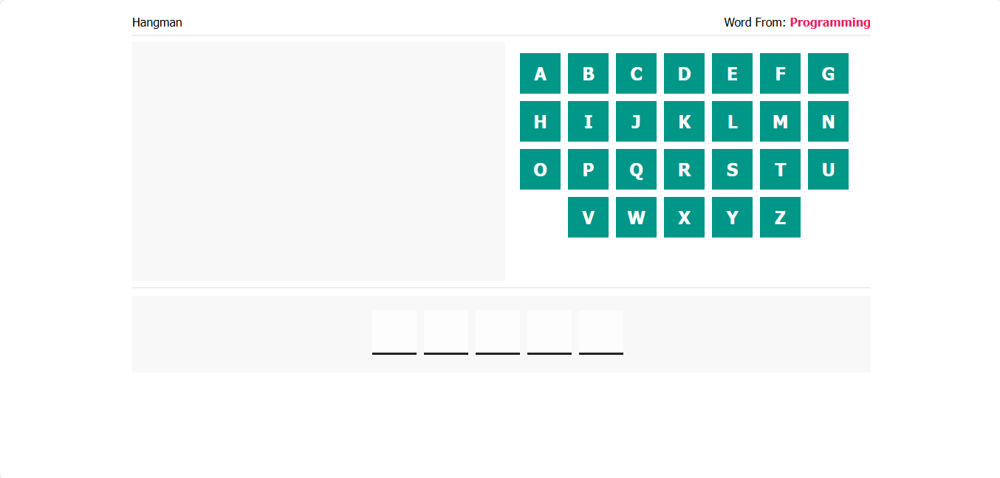
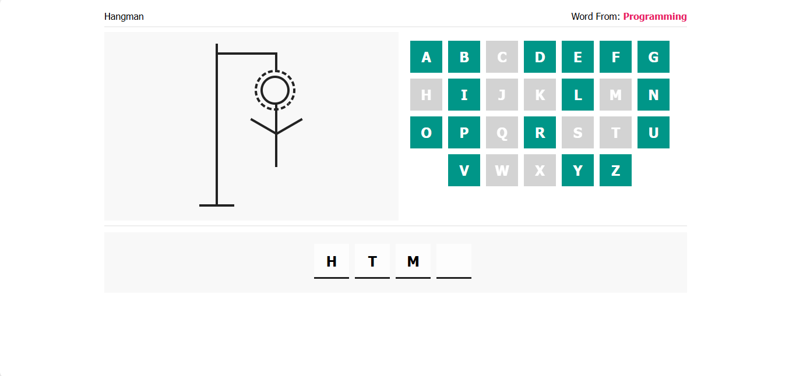
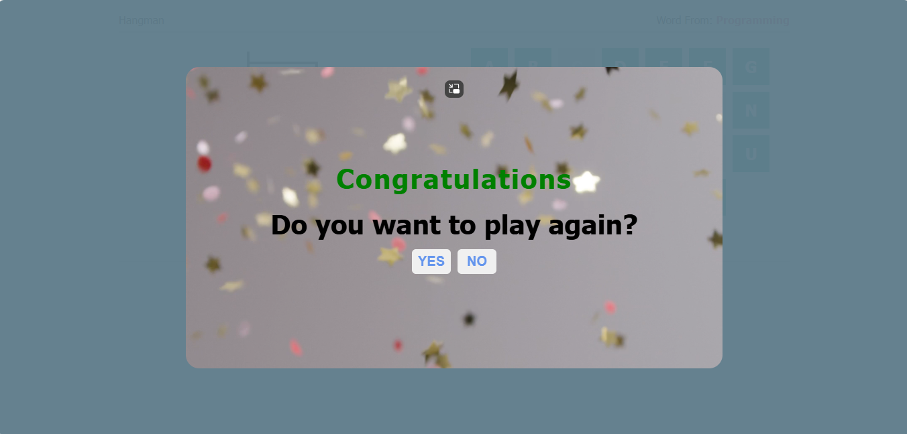

# Hangman-Game
A simple Hangman game built using HTML, CSS, and JavaScript.

## Table of contents

- [Overview](#overview)
  - [Usage](#Usage)
  - [Links](#links)
  - [Screenshot](#Screenshot)
- [My process](#my-process)
  - [Features](#Features)
  - [What I learned](#what-i-learned)
  - [Continued development](#continued-development)
- [Author](#author)
- [Acknowledgments](#Acknowledgments)

## overview
Hangman Game is a classic word guessing game where players try to guess the word by suggesting letters within a certain number of guesses. This project is a simple implementation of the game using web technologies.

## Usage
1. Open `index.html` in your web browser to start the game.
2. Use your mouse to click on the letters and guess the word.
3. Enjoy the game!

### Links

If you want to open the link in a new tab, you can:

- Press **Ctrl** (or **Cmd** on Mac) while clicking the link.
- Right-click the link and select **Open link in new tab**.

Otherwise, all links will open in the same tab.

- Solution URL: [here](https://github.com/olahasan/Hangman-Game)

- Live Site URL: [here](https://olahasan.github.io/Hangman-Game/)

 ## Screenshot
 

## my-process

## Features
- Multiple categories of words (Programming, Movies, People, Countries)
- Interactive UI with animations and sounds
- Responsive design
- Voice feedback using Google Text-to-Speech

## what-i-learned
- Improved my skills in HTML, CSS, and JavaScript.
- Learned how to use the SpeechSynthesis API for voice feedback.
- Gained experience in creating interactive and responsive web applications.
- Enhanced my understanding of DOM manipulation and event handling.

## Continued Development
- Add more categories and words to the game.
- Implement a scoring system to track player performance.
- Enhance the UI with more animations and visual effects.
- Add support for different languages.

### Author

GitHub - @olahasan

### Acknowledgments

I would like to thank the **[Elzero Web School](https://elzero.org/)** for providing this challenge and to the community for their support.

